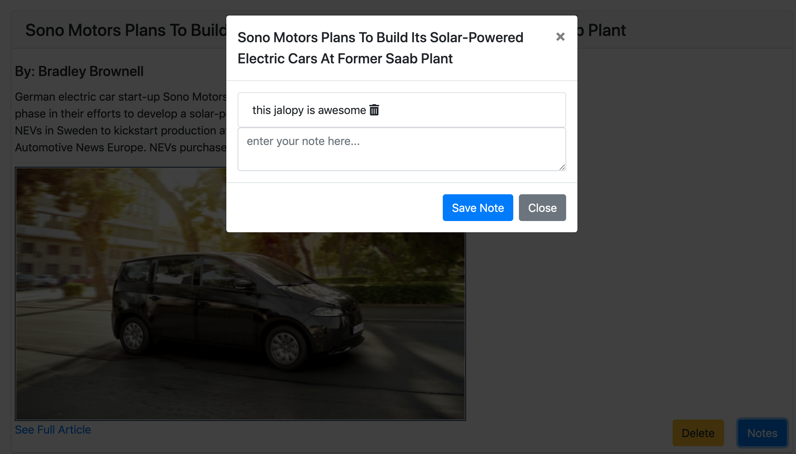

# HW13 | MongoDB Web Scraper

## Link to Live Deployed Page on Heroku
[Heroku Deployed App](https://aqueous-reaches-34767.herokuapp.com/)

## Installation/Usage
* npm-install for initial download of dependent packages
* node server.js to init server
* navigate to localhost:3000 in web browser to init app

### App Screenshots
* Main Page

* Notes Feature on Clipped Articles

### Technologies Used
* Node.JS 
* Express
* Handlebars
* Javascript ES6
* jQuery
* Bootstrap
* Font Awesome CDN
* Mongoose
* MongoDB
* Axios
* Cheerio
* Morgan Logger

### Comments
* Added edge cases for no data using handlebars logic
